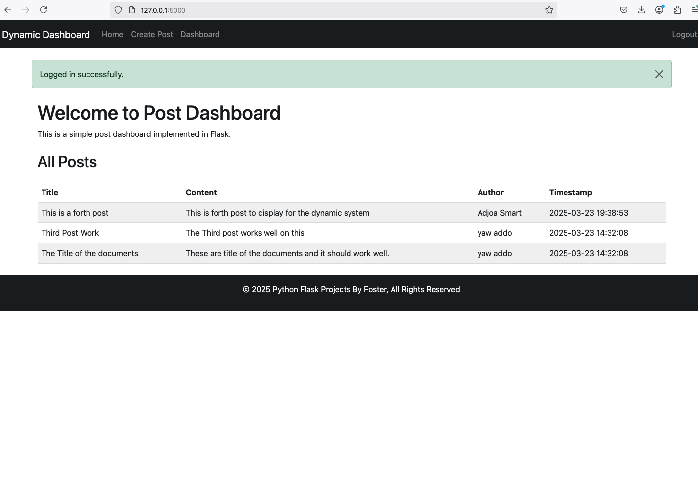
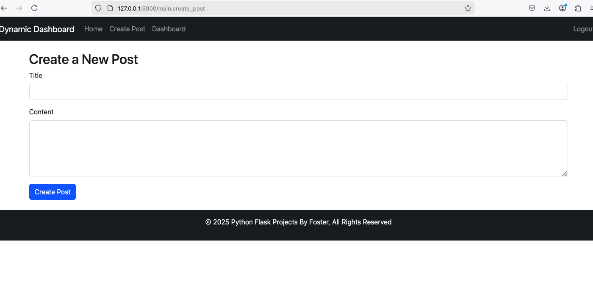
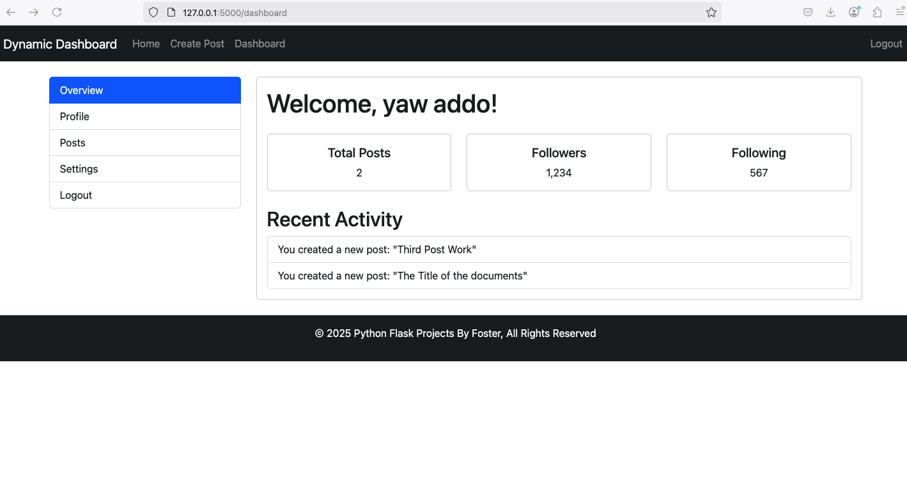

# Real-Time Dynamic Post Dashboard System with Python Flask

## Overview
This project is a **Real-Time Dynamic Post Dashboard System** built using **Python Flask**. It enables users to create, edit, and delete posts while providing real-time updates to the dashboard. The system is designed to be interactive and responsive, making it ideal for applications that require live content updates.


## Features
- 🔄 **Real-time Post Updates**: Instantly reflects changes to posts without requiring a page refresh.
- 📝 **CRUD Operations**: Users can **Create, Read, Update, and Delete** posts seamlessly.
- 🔑 **User Authentication**: Secure login/logout system using Flask-Login.
- 🛡️ **Role-Based Access Control (RBAC)**: Different user roles (Admin, Editor, Viewer) with permissions.
- 📊 **Interactive Dashboard**: A dynamic user interface that displays all posts in real time.
- 🌐 **Flask & WebSockets**: Leveraging WebSockets for live updates and Flask for backend processing.
- 🎨 **Responsive Design**: Optimized for different screen sizes.
- 💬 **Comment System**: Users can comment on posts in real-time.
- 🔔 **WebSocket Notifications**: Notify users when a new post is added.
- 🔍 **REST API Endpoints**: Flask-RESTful API for managing posts and users.
- 📊 **Logging & Error Handling**: Proper logs and exception handling with Python's `logging` module.

## Technology Stack
- **Backend**: Python, Flask, Flask-Login, WebSockets
- **Frontend**: HTML, CSS, JavaScript (with AJAX/WebSockets)
- **Database**: SQLite / PostgreSQL (configurable)
- **Deployment**: Can be hosted on **Heroku, AWS, Render, or any cloud provider**

## Installation

1. Clone the repository:
   ```bash
   git clone <repository-url>
   cd Real-Time-Dynamic-Post-Dashboard-System-with-Python-Flask
   ```

2. Create a virtual environment (optional but recommended):
   ```bash
   python -m venv venv
   source venv/bin/activate  # On Windows use `venv\Scripts\activate`
   ```

3. Install dependencies:
   ```bash
   pip install -r requirements.txt
   ```

## Running the Application

Start the Flask server with:
```bash
python app.py
```
The application will be accessible at `http://127.0.0.1:5000/`.

## Deployment
To deploy this application on a cloud platform like Heroku:
1. Install **Gunicorn** for production:
   ```bash
   pip install gunicorn
   ```
2. Create a `Procfile` with the following content:
   ```
   web: gunicorn app:app
   ```
3. Deploy using Git:
   ```bash
   git add .
   git commit -m "Deploying to Heroku"
   git push heroku main
   ```

## Future Enhancements
- 📌 **User Profile System**: Users can update their profiles and upload profile pictures.
- 🗂️ **Post Categories & Tags**: Organize posts into categories for better accessibility.
- 📈 **Analytics Dashboard**: Show insights on posts and user engagement.
- 🔄 **Social Media Integration**: Share posts directly on social platforms.
- 🌍 **Multilingual Support**: Add support for multiple languages.

## Screenshots




## License
This project is open-source and available under the **MIT License**.

---
### 🔗 Connect with Me
If you liked this project or want to collaborate, feel free to reach out:
- **Portfolio:** [https://fosterdompreh.com](#)
- **LinkedIn:** [https://www.linkedin.com/in/foster-dompreh/](#)
- **GitHub:** [https://github.com/kw3ku](#)

